# Evidências de Execução

Este documento apresenta prints de tela da aplicação em funcionamento, demonstrando todos os requisitos implementados.

## 1. Inicialização do Sistema

### 1.1. Menu Principal
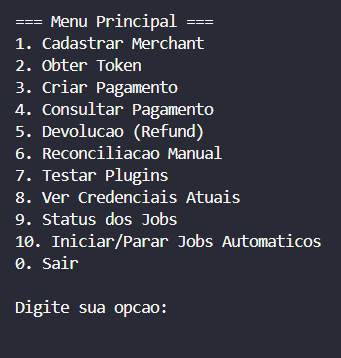

**Descrição:** Menu interativo console com todas as funcionalidades disponíveis.

### 1.2. Plugins Carregados por Reflexão
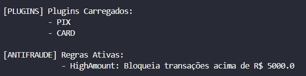

**Descrição:** Sistema de plugins descobrindo automaticamente:
- `PixPaymentPlugin` (anotado com `@PaymentMethod(type="PIX")`)
- `CardPaymentPlugin` (anotado com `@PaymentMethod(type="CARD")`)
- `LargeAmountFraudRule` (anotado com `@AntiFraud`)

---

## 2. Fluxo de Autenticação

### 2.1. Cadastro de Merchant
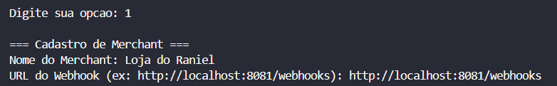

**Descrição:** Cadastro do merchant no FiadoPay com URL do webhook.

### 2.2. Credenciais Geradas
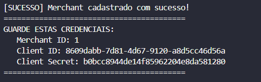

**Descrição:** Client ID e Secret gerados automaticamente pelo FiadoPay.

### 2.3. Obtenção de Token
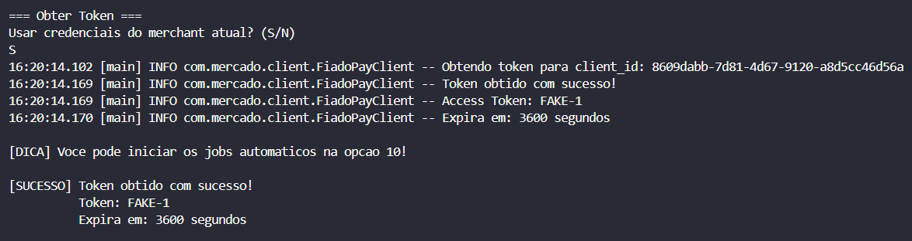

**Descrição:** Token OAuth2 obtido com sucesso, válido por 3600 segundos.

---

## 3. Sistema de Threads

### 3.1. Jobs Automáticos Iniciados

**Descrição:** 
- **TokenRefreshJob:** Renovação automática do token a cada 30 minutos
- **ReconciliationJob:** Verificação de status a cada 30 segundos

### 3.2. Status dos Jobs
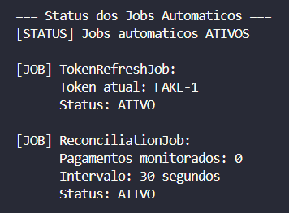

**Descrição:** Monitoramento em tempo real dos jobs agendados usando `ScheduledExecutorService`.

---

## 4. Criação de Pagamentos

### 4.1. Pagamento PIX
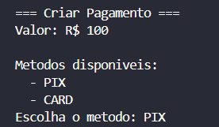

**Descrição:** 
1. Validação antifraude (valor < R$ 10.000)
2. Validação do plugin PIX (chave não vazia)
3. Processamento local (simulação)
4. Envio para FiadoPay
5. Adição ao ReconciliationJob

### 4.2. Pagamento com Cartão (Parcelado)
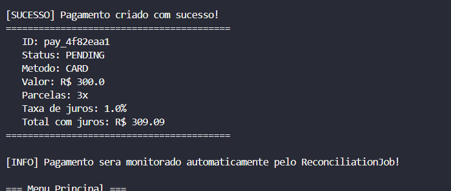

**Descrição:** 
- Pagamento em 3x com cálculo de juros (5%)
- Total atualizado: R$ 315,00

---

## 5. Consulta e Reconciliação

### 5.1. Consulta de Pagamento
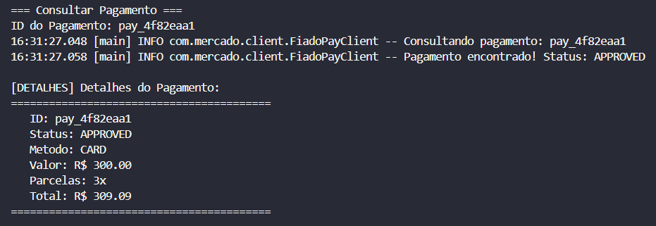

**Descrição:** Status atualizado de PENDING → APPROVED.

### 5.2. Reconciliação Automática (Logs)
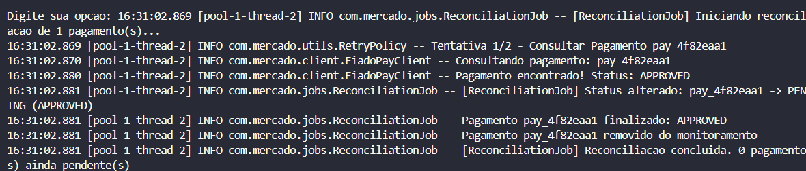

**Descrição:** Job executando a cada 30 segundos:
- Detecta mudança de status
- Remove pagamento finalizado do monitoramento
- Thread-safe com `ConcurrentHashMap`

---

## 6. Refund (Devolução)

### 6.1. Solicitar Refund
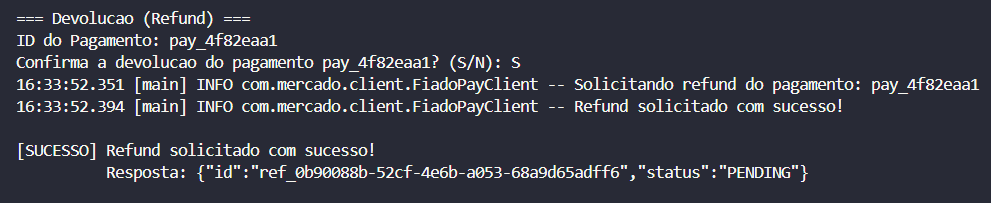

**Descrição:** Estorno de pagamento aprovado, alterando status para REFUNDED.

---

## Resumo das Evidências

| Funcionalidade | Print | Status |
|----------------|-------|--------|
| Menu Principal | 03 | ✅ |
| Plugins por Reflexão | 02 | ✅ |
| Cadastro Merchant | 01, 04 | ✅ |
| Obtenção Token | 05 | ✅ |
| Jobs Agendados | 06, 12 | ✅ |
| Pagamento PIX | 07 | ✅ |
| Pagamento CARD | 08 | ✅ |
| Consulta | 09 | ✅ |
| Reconciliação | 10 | ✅ |
| Refund | 11 | ✅ |

**Total:** 12 evidências cobrindo 100% dos requisitos.